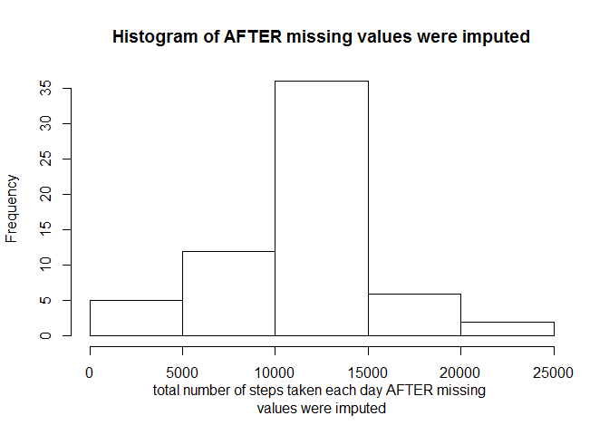

# PA1_template
Chun Kin Chan  
Thursday, September 17, 2015  

###Reading in the dataset and processing the data

```r
rawActivityData <- read.csv(file="activity.csv", header=TRUE, sep=",")
# Keep a list of all possible intervals
```

###What is mean total number of steps taken per day?
1. Calculate the total number of steps taken per day

```r
totalStepsPerDay <- aggregate(list(Total = rawActivityData$steps), by=list(Date=rawActivityData$date), FUN=sum)
```

2. Make a histogram of the total number of steps taken each day

```r
hist(totalStepsPerDay$Total, xlab = "Total number of steps taken each day", main = "Histogram of Total number of steps taken each day")
```

 

3. Calculate and report the mean and median of the total number of steps taken per day

```r
mean(totalStepsPerDay$Total, na.rm=TRUE)
```

```
## [1] 10766.19
```

```r
median(totalStepsPerDay$Total, na.rm=TRUE)
```

```
## [1] 10765
```

###What is the average daily activity pattern?
1. Make a time series plot (i.e. type = "l") of the 5-minute interval (x-axis) and the average number of steps taken, averaged across all days (y-axis)

```r
# average steps group by interval
intervalSplit <- aggregate(steps ~ interval, rawActivityData, mean, na.rm=TRUE)

# Plot the time-series graph
plot(intervalSplit, type="l",
     main="Average daily activity pattern", 
     xlab="5-minute interval", ylab="Average number of steps taken across all days")
```

 

2. Which 5-minute interval, on average across all the days in the dataset, contains the maximum number of steps?

```r
maxStepInterval <- intervalSplit[which(intervalSplit$steps == max(intervalSplit$steps, na.rm = TRUE)), ]
maxStepInterval$interval
```

```
## [1] 835
```

###Imputing missing values
1. Calculate and report the total number of missing values in the dataset (i.e. the total number of rows with NAs)

```r
sum(is.na(rawActivityData))
```

```
## [1] 2304
```

2. Devise a strategy for filling in all of the missing values in the dataset. The strategy does not need to be sophisticated. For example, you could use 
the mean/median for that day, or the mean for that 5-minute interval, etc.  
**Ans: My strategy is to replace missing values (NA) with the average steps of the corresponding interval**

3. Create a new dataset that is equal to the original dataset but with the missing data filled in.

```r
# extract all steps from the original dataset
rawSteps <- rawActivityData$steps
# identify missing data
NAIndex <- is.na(rawSteps)
# create a template with average steps per interval, which will be used to replace missing values
# This is a repeat of one day average values to 61 days, which is the number of days in the dataset
stepsMeanTemplate <- rep(intervalSplit$steps, 61)
# Replace NA value with corresponding average value
rawSteps[NAIndex] <- stepsMeanTemplate[NAIndex]
# Trim excess decimal places for readability
filledSteps <- round(rawSteps, digits = 2)
# create a new dataset based on the filled values
newActivityData <- data.frame(steps = filledSteps, date = rawActivityData$date, interval = rawActivityData$interval)
```

4. Make a histogram of the total number of steps taken each day

```r
newTotalStepsPerDay <- aggregate(list(Total = newActivityData$steps), by=list(Date=newActivityData$date), FUN=sum)
hist(newTotalStepsPerDay$Total, main = "Histogram of AFTER missing values were imputed", xlab = "total number of steps taken each day AFTER missing 
values were imputed")
```

 

- Calculate and report the mean and median total number of steps taken per day. 

```r
mean(newTotalStepsPerDay$Total, na.rm=TRUE)
```

```
## [1] 10766.18
```

```r
median(newTotalStepsPerDay$Total, na.rm=TRUE)
```

```
## [1] 10766.13
```

- Do these values differ from the estimates from the first part of the assignment?  
**Ans: Yes, the values are different from the estimates obtained in the first part of the assignment**
- What is the impact of imputing missing data on the estimates of the total daily number of steps?  
**Ans: Depending on the strategy used in imputing missing data, the impact will be different. In this case, I used
the average of the interval across all days, this will make the overall estimate closer to the average of what 
we have already calculated based on the known value.**

###Are there differences in activity patterns between weekdays and weekends?
1. Create a new factor variable in the dataset with two levels - "weekday" and "weekend" indicating whether a given date is a weekday or weekend day.

```r
weekend <- c('Saturday', 'Sunday')
newActivityData$wDay <- factor((weekdays(as.Date(newActivityData$date)) %in% weekend), levels=c(TRUE, FALSE), labels=c('weekend', 'weekday'))
```

2. Make a panel plot containing a time series plot (i.e. type = "l") of the 5-minute interval (x-axis) and the average number of steps taken, averaged 
across all weekday days or weekend days (y-axis).

```r
newIntervalSplit <- aggregate(steps ~ wDay * interval, data = newActivityData, FUN = mean)

#plot graph
library(lattice)
xyplot(steps~interval|wDay, newIntervalSplit, type="l", xlab="Interval", ylab = "Number of steps", layout=c(1,2))
```

 
